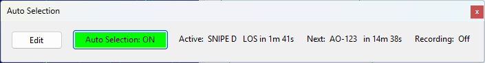
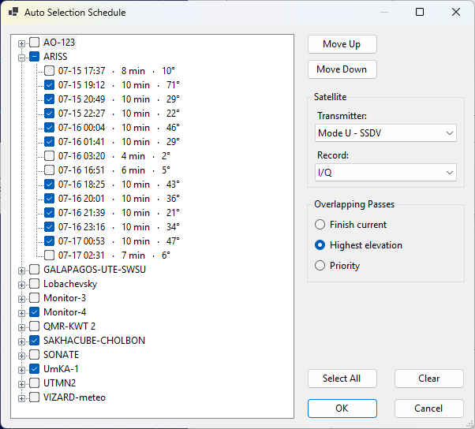

# Auto Selection Panel

The Auto Selection panel lets SkyRoof automatically tune to each satellite in a schedule at the start of
its pass (AOS) and hold it until the pass ends (LOS), cycling through a set of passes you choose. Each pass
can optionally be recorded to its own file, and satellites can also take part without recording so their
live telemetry is decoded as they pass over.

Auto selection works on the **current satellite group**. Each group keeps its own schedule, so switching
groups switches schedules.

## Status Panel

The panel shows the live status of auto-selection for the current group:

- **Edit** — opens the [schedule dialog](#the-schedule-dialog) for the current group.
- **Auto Selection: ON / OFF** — the master toggle. It is disabled until the current group has a
  schedule, and lights up in green while auto selection is running. Auto selection always starts **OFF**
  when the program launches; you turn it on deliberately each session.
- **Active** — the pass currently tuned, with the time remaining until its LOS, or **none** when no pass
  is active.
- **Next** — the next scheduled pass and the time until its AOS, or **none** when nothing is coming up.
- **Recording** — the recording type and elapsed time while a pass is being recorded, or **Off** when
  nothing is being recorded.

While auto selection is on, changing the satellite, transmitter, or group **by hand** stops auto selection
and shows a message. Your manual change is applied normally; re-enable auto selection when you are ready.

Closing the Auto Selection panel also stops auto selection, since there is no longer anywhere to monitor
or control it.

## The Schedule Dialog

Click **Edit** to open the schedule dialog for the current group.

### Rotation Tree

The tree lists every satellite in the group (except geostationary satellites, which have no passes) as a
parent node, with its upcoming passes over the next 48 hours as child nodes. Each pass leaf shows its AOS
local time, duration, and maximum elevation.

Use the checkboxes to choose which passes take part in the rotation:

- clicking a **satellite** checkbox selects or clears all of its passes;
- clicking a **pass** checkbox selects that single pass;
- a satellite checkbox is shown in an **indeterminate** state when only some of its passes are selected.

The order of the satellite nodes is the **priority** order (top = highest). Select a satellite and use
**Move Up** / **Move Down** to change its priority.

Use **Select All** to check every pass of the group at once, or **Clear** to uncheck them all. Clicking
**OK** with no passes checked removes the current group's schedule.

### Satellite Settings

Select a satellite node to edit its settings:

- **Transmitter** — the transmitter to tune when a pass of this satellite is selected.
- **Record** — how to record each pass of this satellite:
  - **Off** — do not record. The satellite is still tuned, so live telemetry is decoded during the pass.
  - **Audio** — record the demodulated audio as an `.mp3` file.
  - **I/Q** — record the complex baseband signal as an `.iq.wav` file.

### Overlap Mode

When two selected passes are up at the same time, the **overlap mode** decides which one is tuned:

- **Finish current** — once a pass is entered at its AOS, it is held until its LOS, then the next selected
  pass that is still up is entered.
- **Highest elevation** — the currently-up selected pass with the greatest elevation is tuned, switching
  only when another pass is clearly higher (to avoid rapid switching back and forth).
- **Priority** — the currently-up selected pass whose satellite has the highest priority is tuned; a
  higher-priority pass rising over the horizon takes over, and when it sets the next-highest still-up pass
  is entered.

Click **OK** to save the schedule, or **Cancel** to discard your changes. Reopening the dialog extends the
list to the next 48 hours and keeps your previously selected passes.

## Recordings

Auto-selection recordings are saved into the **Auto** subfolder of the **Recordings** folder inside the
[data folder](data_folder.md). Each contiguous segment becomes one file, named with its start time and the
satellite name. Audio is saved as `.mp3` and I/Q as `.iq.wav`, the same formats as the
[Recorder panel](recorder_panel.md).
