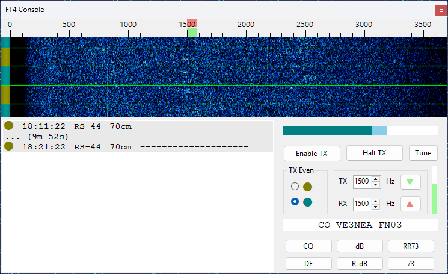

# FT4 Console Panel

The FT4 Console provides a streamlined, satellite‑optimized interface for conducting FT4 QSOs via satellites with linear transponders (e.g., RS‑44, AO‑73, JO‑97). While similar results can be obtained by running two instances of WSJT‑X side by side with SkyRoof, the Console removes the need for external programs and simplifies the workflow. It offers satellite‑specific features not available in general‑purpose FT4 software, and an intuitive user interface that improves efficiency and usability.

Be sure to configure the [FT4 Console settings](setting_up_ft4_console.md) before you start using the FT4 Console panel.

