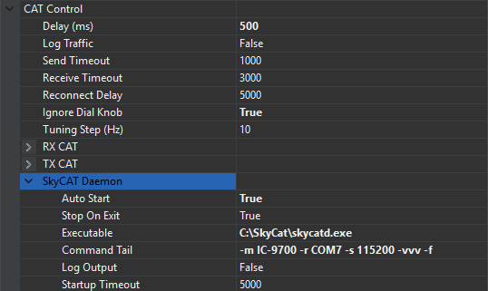
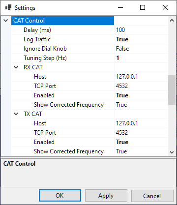

# Setting Up CAT Control

SkyRoof uses an external program, either skyctld.exe from SkyCAT or rigctld.exe from HamLib, to control the transceiver. In both cases the CAT control commands are sent using the TCP protocol, so the radio may be moved to a remote computer and controlled via the network if desired.

## SkyCAT

SkyCAT is specifically designed for the best satellite tracking experience. It has an open architecture where support of the new radio models is added by creating the command definition files with the corresponding commands. Check the [SkyCAT web site](https://ve3nea.github.io/SkyCAT/index.html)
for the list of currently supported radios. If your radio model is not yet supported, either create a command definition file for it using the instructions on the SkyCAT web site, or use rigctld.exe instead (see below).

## Using skycat.exe

If your radio is supported by SkyCAT, use skycatd.exe, a command line program that comes as part of the SkyCAT package. To start using it, follow the
[setup instructions](https://ve3nea.github.io/SkyCAT/skycatd.html) on the SkyCAT web site.

The latest command definition files are available [here](https://github.com/VE3NEA/SkyCAT/tree/master/Rigs).
Update the file for your radio before you proceed.

### Starting skycatd.exe automatically

SkyRoof can start **skycatd.exe** for you when it starts and stop it again when it closes, so that you do
not have to launch the daemon by hand before every session. The settings are in the **SkyCAT Daemon**
section of **CAT Control** in the [Settings dialog](settings_window.md):




- **Auto Start** - start skycatd.exe when SkyRoof starts, and start it again if it exits while SkyRoof is
    running, so that power-cycling the radio does not leave you without CAT control for the rest of the
    session. Restarts back off from 5 seconds to a minute, so a daemon that fails immediately because it
    is misconfigured is retried slowly rather than continuously. The daemon is started for the RX radio,
    or for the TX radio when RX CAT is disabled or its **Host** is another computer. Nothing is started
    when both are disabled, or when neither of them is on this computer;
- **Stop On Exit** - stop skycatd.exe when SkyRoof closes, and whenever its configuration stops
    applying: **Auto Start** switched off, CAT control switched off, or the CAT **Host** changed to
    another computer. Only a daemon that SkyRoof itself started is ever stopped. Changing this applies to
    a daemon that is already running, in either direction, and the SkyCAT panel confirms it;
- **Executable** - the full path to skycatd.exe, for example `C:\SkyCAT\skycatd.exe`;
- **Command Tail** - the command line arguments for your radio, for example
    `-m IC-9700 -r COM9 -s 115200 -f`.
    Use the same arguments you would type on the command line, minus the `-t` port argument: SkyRoof
    appends `-t` itself, from the **TCP Port** in the CAT settings. A `-t` of your own is dropped, with
    a note in the panel, because the daemon has to serve the port CAT control connects to;
- **Log Output** - copy skycatd.exe output into the SkyRoof log. Off by default: the SkyCAT panel shows
    the output either way, and the SkyRoof log rolls at 3 MB, so a verbose daemon copied into it pushes
    everything else out. Turn it on only when you need the daemon's output interleaved with SkyRoof's own;
- **Startup Timeout** - how long, in milliseconds, SkyRoof waits for skycatd.exe to start listening before
    it gives up and lets CAT control connect on its own schedule, up to 30 seconds. This wait happens only
    while SkyRoof is starting, and it happens before the main window appears, which is why it is capped;
    a settings change or a click on the CAT indicator never waits.

skycatd serves one radio on one TCP port. If RX CAT and TX CAT point at two different local ports, for two
separate radios, SkyRoof starts a daemon for one of them and says so in the SkyCAT panel; the second radio
needs its own skycatd started by hand.

If skycatd.exe is already listening on the CAT port when SkyRoof starts, SkyRoof uses the running daemon
instead of starting a second one, and leaves it running when it closes. Because that daemon was started
elsewhere, SkyRoof cannot see or change its command line: editing **Command Tail** or **Executable** has no
effect on it, and the SkyCAT panel says so rather than letting the edit look as though it was accepted.

### Watching the daemon

skycatd.exe runs without a console window of its own, so its output goes to the
[SkyCAT panel](skycat_panel.md), opened from **View / SkyCAT**, and to the SkyRoof log as well when
**Log Output** is on. The panel replays what the daemon has already printed and then follows it live, and
says whether the daemon is running and whether SkyRoof started it. It is also where SkyRoof explains
itself: every decision it takes about the daemon is written there on a line beginning `==`. See the
[SkyCAT panel](skycat_panel.md) page for what those lines mean, and for watching the CAT traffic itself.

### When the radio is switched off

skycatd does not give up if the serial port cannot be opened: it logs a warning, keeps retrying, and
opens its TCP port only once the radio answers. SkyRoof recognizes this, stops waiting out the startup
timeout, and notes it in the panel. CAT control then connects by itself as soon as you switch the radio
on, with no need to restart either program.

## Using rigctld.exe

If a SkyCAT command definition file for your transceiver is not yet available, use **rigctld.exe**, a HamLib-based CAT control daemon. Note, however, that some commands may not work properly with rigctld.exe.

1. Download **hamlib-w64-4.5.5.exe** [from GitHub](https://github.com/Hamlib/Hamlib/releases/tag/4.5.5).
Other versions may not work correctly.
2. Run the downloaded file to install HamLib, note the folder where it is installed.
3. Create a shortcut to start **rigctld.exe*, with command line arguments:

    

    The arguments on the command line must be tailored for your specific radio and COM port settings. Refer to the
    [rigctld documentation](https://hamlib.sourceforge.net/html/rigctld.1.html) for a complete description
    of the arguments.

    Assuming that HamLib is installed in the default location, here is an example string for the shortcut:

    ```cmd
    "C:\Program Files\hamlib-w64-4.5.5\bin\rigctld.exe" -m 3081 -r COM9 -s 115200 
    ```

    In the string above the following arguments are used:

    - **-m 3081** - the radio model; 3081 is the Id of IC-9700 (see the
    [list of id's](https://github.com/Hamlib/Hamlib/wiki/Supported-Radios));
    - **-r COM9** - the COM port used by the radio. In this case, the USB connection to IC-9700 creates two virtual
        COM ports, COM9 and COM10. The port with the lower number is used for CAT;
    - **-s 115200** - use the highest available COM port speed;
    - **-vvvvv** - optional, writes detailed information to the console window. Useful for troubleshooting.

4. Run rigctld.exe using this shortcut before you enable CAT control in SkyRoof.

## Settings

The CAT Control settings in the [Settings dialog](settings_window.md) are the same for skycatd.exe and rigctld.exe.

Click on **Tools / Settings** in the main menu to open the **Settings dialog**:



- **Delay** determines how often SkyRoof sends commands to the radio. The default delay of 100 ms
    is good in most cases. Increase the delay if your radio's CAT interface is slow;
- **Log Traffic** should be set to False and enabled only for debugging;
- **Ignore Dial Knob** - by default, CAT control allows you to change the frequency both in the program and by
    spinning the dial knob. If for some reason this causes trouble, change this setting to True, so that the dial knob rotation is ignored.

The **SkyCAT Daemon** section is described above, under
[Starting skycatd.exe automatically](#starting-skycatdexe-automatically). It applies only to skycatd.exe;
rigctld.exe is always started by hand.

The two sections in the Settings, **RX CAT** and **TX CAT**, allow you to use either the same radio for RX and TX, or
two different radios. You can also enable only one of those, or disable both. The recommended configuration is to use an SDR for reception and a transceiver for transmission, in this case RX CAT should be disabled.

To use the same radio for RX and TX, set **Host** and **TCP Port** to the same values in
both sections.

To use two different radios, create a second shortcut for the second radio, and specify a different port number on the command line.
Enter this port number in the settings as well, and run two instances of **rigctld.exe** using both shortcuts.

The settings in the RX and TX sections are:

- **Host** - should be "127.0.0.1" or "localhost" if skycatd or rigctld is running on the same computer as SkyRoof. It may be changed to a different address for remote control;
- **TCP Port** - 4532 is the default port used by skycatd and rigctld. Use a different port in one of the sections to control different radios for RX and TX;
- **Enabled** - enable or disable CAT. Another way to toggle CAT is to click on the CAT labels on the status bar:

    

- **Show Corrected Frequency** - The SkyRoof can display either the nominal frequency of the satellite transmitter, or the
    frequency with all corrections applied. Another way to toggle this setting is via the right-click menu on the frequency display widget on the toolbar.

## Using CAT with a Transverter

If your transceiver does not understand VHF/UHF frequencies (e.g., a "dumb" HF rig connected
via a transverter, or an HF rig such as the IC-7300), enable the **RX CAT Offset** and / or
**TX CAT Offset** in the **Transverter** section of the Settings. SkyRoof will then send the
IF frequency (e.g., 29.950 MHz) to the radio instead of the satellite RF (e.g., 145.950 MHz).
Modern rigs with built-in XVRT support (e.g., the K3S) do their own conversion internally and
should leave these offsets **disabled**.

When a CAT offset is enabled but no transverter band covers the current frequency, the **RX CAT**
or **TX CAT** label on the status bar turns **yellow** and SkyRoof skips the CAT command rather
than send a frequency the radio cannot tune. Hover over the label to see the explanation.

See [Setting Up Transverter](setting_up_transverter.md).

## Model-Specific Notes

### IC-9700

- set **CI-V USB Port** in the transceiver menu to **Unlink from REMOTE**;
- note that the radio is used in the Dual Watch mode, not in the Sat mode, so the upper frequency on the transceiver screen is uplink, the lower one is downlink.

## IC-991A

- set **CAT RTS** in the transceiver menu to Disabled.
