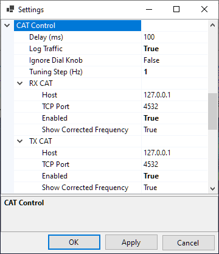

# Setting Up CAT Control

SkyRoof uses an external program, either skyctld.exe from SkyCAT or rigctld.exe from HamLib, to control the transceiver. In both cases the CAT control commands are sent using the TCP protocol, so the radio may be moved to a remote computer and controlled via the network if desired.

## SkyCAT

SkyCAT is specifically designed for the best satellite tracking experience. It has an open architecture where support of the new radio models is added by creating the command definition files with the corresponding commands. Check the [SkyCAT web site](https://ve3nea.github.io/SkyCAT/index.html)
for the list of currently supported radios. If your radio model is not yet supported, either create a command definition file for it using the instructions on the SkyCAT web site, or use rigctld.exe instead (see below).

## Using skycat.exe

If your radio is supported by SkyCAT, use skycatd.exe, a command line program that comes as part of the SkyCAT package. To start using it, follow the
[setup instructions](https://ve3nea.github.io/SkyCAT/skycatd.html) on the SkyCAT web site.


## Using rigctld.exe

If a SkyCAT command definition file for your transceiver is not yet available, use **rigctld.exe**, a HamLib-based CAT control daemon. Note, however, that some commands may not work properly with rigctld.exe.

1. Download **hamlib-w64-4.5.5.exe** [from GitHub](https://github.com/Hamlib/Hamlib/releases/tag/4.5.5).
Other versions may not work correctly.
2. Run the downloaded file to install HamLib, note the folder where it is installed.
3. Create a shortcut to start **rigctld.exe*, with command line arguments:

    

    The arguments on the command line must be tailored for your specific radio and COM port settings. Refer to the
    [rigctld documentation](https://hamlib.sourceforge.net/html/rigctld.1.html) for a complete description
    of the arguments.

    Assuming that HamLib is installed in the default location, here is an example string for the shortcut:

    ```cmd
    "C:\Program Files\hamlib-w64-4.5.5\bin\rigctld.exe" -m 3081 -r COM9 -s 115200 
    ```

    In the string above the following arguments are used:

    - **-m 3081** - the radio model; 3081 is the Id of IC-9700 (see the
    [list of id's](https://github.com/Hamlib/Hamlib/wiki/Supported-Radios));
    - **-r COM9** - the COM port used by the radio. In this case, the USB connection to IC-9700 creates two virtual
        COM ports, COM9 and COM10. The port with the lower number is used for CAT;
    - **-s 115200** - use the highest available COM port speed;
    - **-vvvvv** - optional, writes detailed information to the console window. Useful for troubleshooting.

4. Run rigctld.exe using this shortcut before you enable CAT control in SkyRoof.

## Settings

The CAT Control settings in the [Settings dialog](settings_window.md) are the same for skycatd.exe and rigctld.exe.

Click on **Tools / Settings** in the main menu to open the **Settings dialog**:



- **Delay** determines how often SkyRoof sends commands to the radio. The default delay of 100 ms
    is good in most cases. Increase the delay if your radio's CAT interface is slow;
- **Log Traffic** should be set to False and enabled only for debugging;
- **Ignore Dial Knob** - by default, CAT control allows you to change the frequency both in the program and by
    spinning the dial knob. If for some reason this causes trouble, change this setting to True, so that the dial knob rotation is ignored.

The two sections in the Settings, **RX CAT** and **TX CAT**, allow you to use either the same radio for RX and TX, or
two different radios. You can also enable only one of those, or disable both. The recommended configuration is to use an SDR for reception and a transceiver for transmission, in this case RX CAT should be disabled.

To use the same radio for RX and TX, set **Host** and **TCP Port** to the same values in
both sections.

To use two different radios, create a second shortcut for the second radio, and specify a different port number on the command line.
Enter this port number in the settings as well, and run two instances of **rigctld.exe** using both shortcuts.

The settings in the RX and TX sections are:

- **Host** - should be "127.0.0.1" or "localhost" if skycatd or rigctld is running on the same computer as SkyRoof. It may be changed to a different address for remote control;
- **TCP Port** - 4532 is the default port used by skycatd and rigctld. Use a different port in one of the sections to control different radios for RX and TX;
- **Enabled** - enable or disable CAT. Another way to toggle CAT is to click on the CAT labels on the status bar:

    

- **Show Corrected Frequency** - The SkyRoof can display either the nominal frequency of the satellite transmitter, or the
    frequency with all corrections applied. Another way to toggle this setting is via the right-click menu on the frequency display widget on the toolbar.
