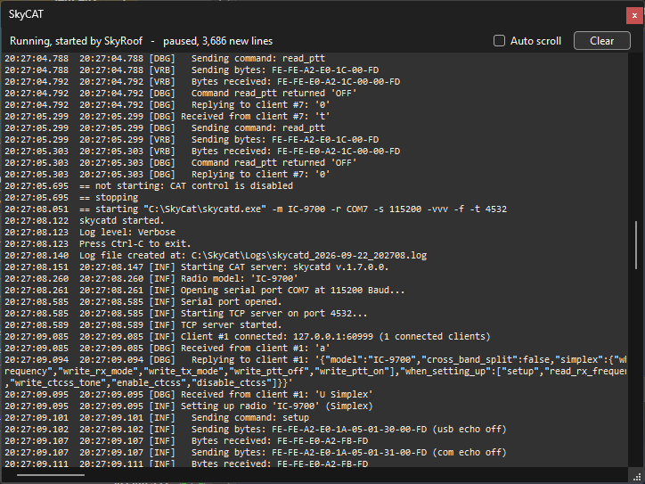

# SkyCAT Panel

The SkyCAT panel is a live view of **skycatd.exe**, the CAT daemon of the SkyCAT package. SkyRoof can
[start and stop the daemon together with itself](setting_up_cat_control.md#starting-skycatdexe-automatically),
and it starts it without a console window of its own, so this panel is where the daemon's output can be
read. Open it from the **View / SkyCAT** menu.

The picture shows the panel a moment after CAT control was switched off and on again: SkyRoof's own
account of what it did, on the lines beginning `==`, and then skycatd's, as it opens the serial port and
starts serving. It is also paused, which is why the status line says so and counts what has arrived.

The panel is a view and nothing more. Whether the daemon is started, with what command line, and whether
it is stopped again on exit are all decided in the **SkyCAT Daemon** section of the
[CAT Control settings](setting_up_cat_control.md#starting-skycatdexe-automatically). Closing the panel does
not stop the daemon, and the daemon runs whether or not the panel is open — opening it later replays what
has been printed so far.

## Status

The line at the top left says what SkyRoof currently knows about the daemon:

- **Running, started by SkyRoof** — SkyRoof launched this daemon and will stop it again if **Stop On
  Exit** is set. Its output appears below;
- **Running, started outside SkyRoof** — a daemon was already listening on the CAT port, so SkyRoof is
  using it rather than starting a second one, and will leave it running when it closes. Its output belongs
  to whoever started it and cannot be shown here; SkyRoof re-checks every few seconds that it is still
  listening, and says so if it goes away;
- **Auto Start is off** — the feature is switched off, which is the default. SkyRoof neither starts nor
  looks for a daemon;
- **Not running** — **Auto Start** is on but no daemon is running. The reason is in the output, on a line
  beginning `not starting:`.

## Output

The box below shows two kinds of line, both stamped with the local time:

- the daemon's own output, exactly as it printed it;
- SkyRoof's account of what it did with the daemon, marked with `==` so it stands apart.

The last 5000 lines are kept. Open the panel and you get that whole history, not just what arrives from
then on, which is what makes it useful for working out why a daemon that failed at startup failed.

- **Auto scroll** keeps the newest line in view. Clear it and the panel **freezes**: the box stops
  changing altogether, so you can scroll back and read without the text moving under you. The daemon
  keeps collecting output the whole time, and the status line says `paused` with a count of what has
  arrived, so a frozen panel is never mistaken for a daemon that has gone quiet. Tick **Auto scroll**
  again and the panel catches up to the newest line.

    Freezing rather than merely stopping the scroll is deliberate. The panel keeps the last 5000 lines,
    and a daemon run with `-vvv` produces around thirty a second, so the oldest lines are being discarded
    while you read them - within a couple of minutes the whole buffer has turned over. A view that tried
    to hold its place in text that is being deleted behind it looked exactly like a panel scrolling on
    its own. If you need to keep more than the buffer holds, keep `-f` in the command tail and read
    skycatd's own log file;
- **Clear** empties the box and the buffer together, so what you cleared does not come back when the panel
  is closed and opened again.

None of this reaches the SkyRoof log unless **Log Output** is set in the settings. The panel is an
in-memory buffer and costs nothing; the SkyRoof log rolls at 3 MB, so a verbose daemon copied into it
pushes everything else out.

## The `==` Lines

SkyRoof's own lines are worth reading when something is not working. The ones you are most likely to see:

| Line | Meaning |
|---|---|
| `starting "…\skycatd.exe" -m …` | the exact command line used, after any `-t` of yours was replaced by the CAT port |
| `listening on 127.0.0.1:4532` | the daemon came up and accepted a connection; CAT control can now connect |
| `cannot open the serial port - is the radio switched on?` | skycatd could not open the COM port. It keeps retrying and opens its TCP port once the radio answers, so switching the radio on is all that is needed |
| `not starting: …` | why no daemon is running — no executable path configured, the path does not exist, CAT control disabled, or no CAT radio on this computer |
| `EXITED unexpectedly with code n` / `restarting in n s` | the daemon died on its own and will be started again. The delay backs off from 5 seconds to a minute, so a daemon that fails immediately every time is not retried continuously |
| `ignoring '-t 9999' in the command tail` | a port option in your command tail was dropped, because the daemon has to serve the port CAT control connects to |
| `… is NOT served by this daemon` | a second local radio is configured on another port. skycatd serves one radio on one port, so that one needs its own daemon started by hand |
| `a daemon is listening on …, adopting it` | somebody started a daemon while SkyRoof was running, and it is now being used as it is |
| `leaving the daemon running, …` | on exit, why the daemon was not stopped — either **Stop On Exit** is off, or SkyRoof did not start it |

## Watching CAT Traffic

To see the commands and replies going to and from the radio as they happen, put `-vvv` in the
**Command Tail**. The daemon then prints every exchange, which the panel follows without trouble; leave
**Log Output** off so that none of it reaches the SkyRoof log.

For a record to study after the session, keep `-f` in the command tail as well. skycatd then writes its own
log file in the folder it runs from, at a level of detail beyond what is shown here. That folder has to be
writable, so if skycatd.exe lives under `C:\Program Files`, either run it from a copy elsewhere or leave
`-f` off.
